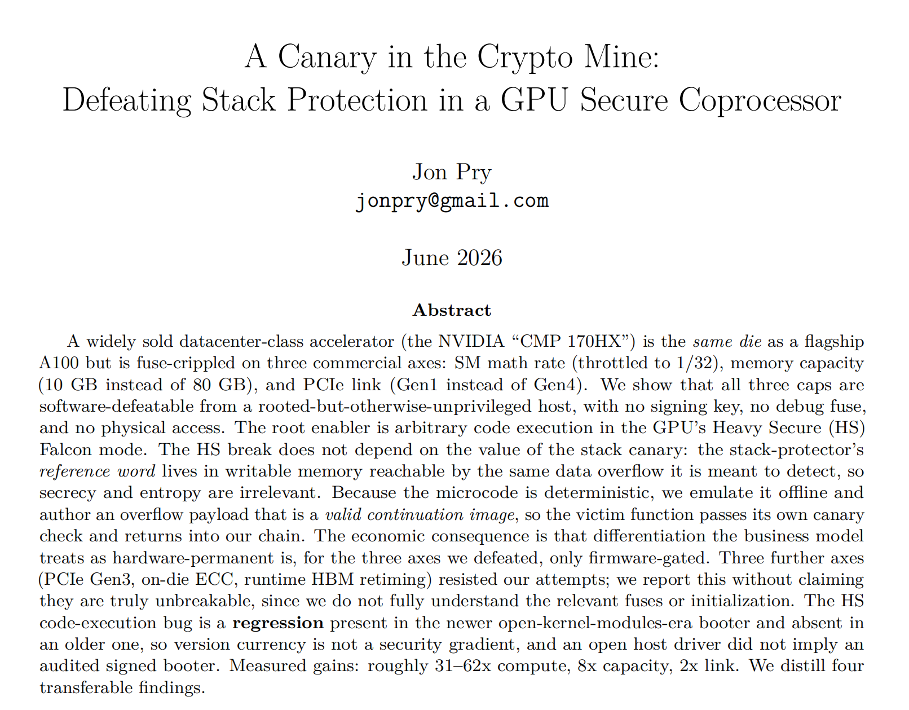
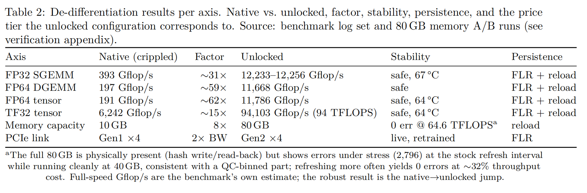
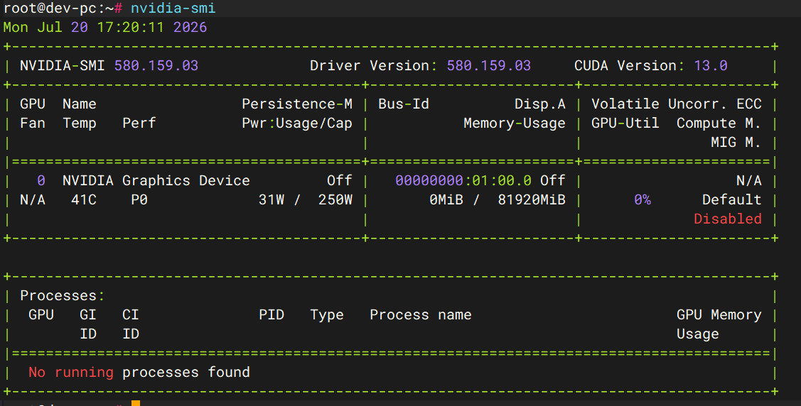
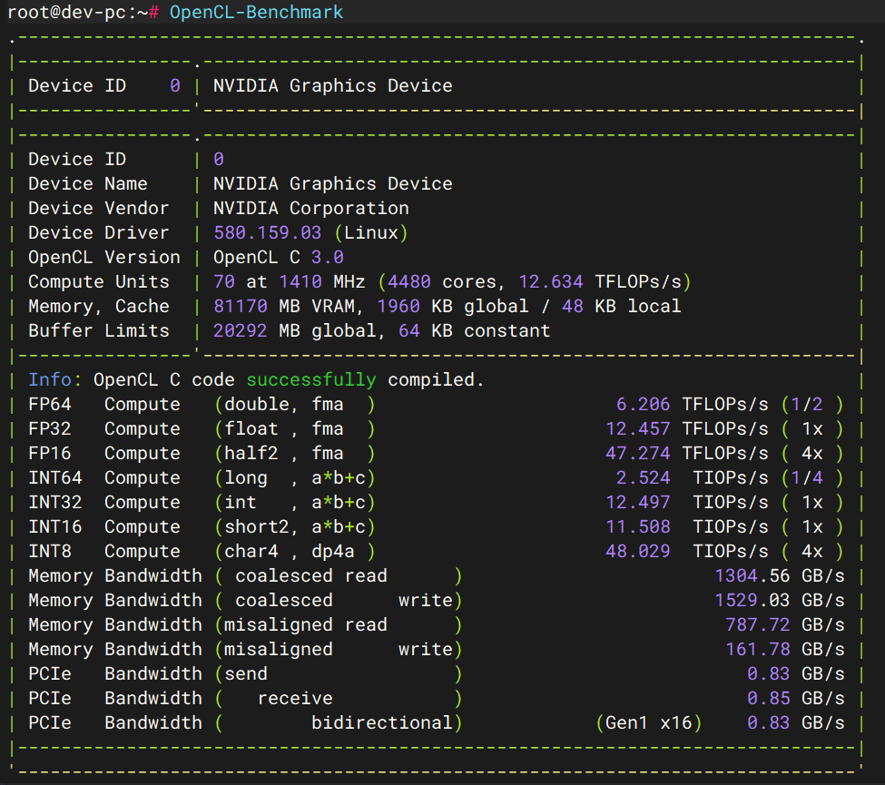
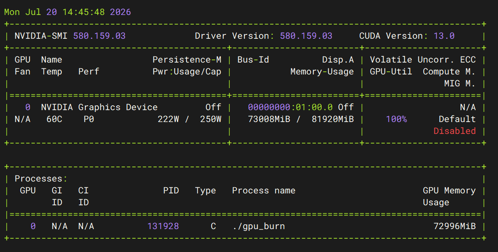

# cmp-easyunlock
A professional unlock utility for NVIDIA CMP 170HX (GA100) mining accelerator
This project permanently restores the full SM compute throughput and native HBM2e memory geometry of the NVIDIA CMP 170HX GPU, which are artificially restricted by factory firmware and OTP one-time programmable configuration. It unlocks the complete hardware performance of the GA100 die (consistent with A100 silicon).

**[Join our Discord community](https://discord.gg/CdHSakKSFv)** for support and discussions.

Reference paper: [A Canary in the Crypto Mine: Defeating Stack Protection in a GPU Secure Coprocessor](https://www.researchgate.net/publication/408132536_A_Canary_in_the_Crypto_Mine_Defeating_Stack_Protection_in_a_GPU_Secure_Coprocessor)


## 🎯 Supported Environment
Exclusive Compatibility: Linux platform with nvidia-open driver 580.159.03
This tool is strictly developed and verified for the specified open-source driver version. Compatibility with other driver versions and operating systems is not guaranteed.

## 📌 Device Background
The NVIDIA CMP 170HX adopts a full-spec GA100 GPU die, identical to the silicon used in NVIDIA A100 professional computing cards. NVIDIA artificially limits its computing throughput and memory specifications through firmware and OTP locking for mining-oriented market positioning. This project breaks through official hardware-level restrictions to release the full native performance of the GA100 core.

## 📚 Academic Reference
The technical implementation of this project refers to the core research achievements of the following academic paper on GPU secure coprocessor stack protection breakthrough:
A Canary in the Crypto Mine: Defeating Stack Protection in a GPU Secure Coprocessor
<p align="center">

</p>

<p align="center">

</p>

## ⚠️ Important Notices
- Version Limitation: Currently, only the CMP170 10G hardware version supports 80G memory specification upgrade and full performance unlock.
- Stability Warning: The 10G → 80G memory unlock solution is still in continuous optimization and iteration. The current solution has incomplete stability and is not recommended for long-term commercial or production scenarios.
- Open Source Statement: All codes and schemes of this project are only for academic research and technical communication. Commercial use, secondary packaging and profit-making behaviors are prohibited. The author is not responsible for any hardware damage, system exceptions or legal risks caused by unauthorized use.


## 🚀 Quick Start
**Unlock to 80G** Full Specification
Execute the one-click unlock script to restore full memory and computing performance:
```
./unlock.sh
```

Restore Official 10G Default Specification
Execute the reset script to roll back to the factory locked state:
```
./reset.sh
```

## 📊 Verification Results
All test results are based on the standard Linux benchmark environment after successful unlocking, verifying the effectiveness of performance and memory restoration.

1. NVIDIA-SMI Memory & Hardware Recognition
<p align="center">

</p>

After unlocking, the GPU correctly recognizes 80G HBM2e full-spec memory, and the hardware parameter restriction of the original factory is completely removed.


2. OpenCL Computing Benchmark

<p align="center">

</p>

The OpenCL benchmark test verifies that the SM computing throughput is fully restored, with the computing performance reaching the native level of GA100 die.


3. GPU Stability Burn Test

<p align="center">

</p>

The gpu-burn high-load pressure test verifies the running state of the GPU after unlocking, covering full-load computing and memory read-write scenarios.


## 💬 Community & Support
Join our Discord community to get the latest project updates, technical troubleshooting, and in-depth technical discussions with developers and researchers:
Discord Community: https://discord.gg/CdHSakKSFv

## 📄 License & Disclaimer
This project is for technical research purposes only. All modification and unlocking behaviors may violate the hardware warranty and official user agreement of NVIDIA. Users shall independently bear all risks arising from the use of this project. The author does not undertake any direct or indirect liability.
